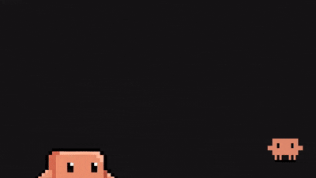

# Clawd: The Context-Aware Browser Pet

An open-source, interactive, context-aware browser mascot pet companion extension built using the [clawd-pet](https://github.com/abderrahimghazali/clawd-pet) SVG library. The pet crawls along the edges of your browser viewport, monitors your activity, and updates its expression in response to your browsing context and site errors!

*Mascot SVG assets are adapted from the open-source [clawd-pet](https://github.com/abderrahimghazali/clawd-pet) library by Abderrahim Ghazali, used under the MIT License.*

<p align="center">
   
</p>

<p align="center">
  <a href="https://www.typescriptlang.org/"></a>
  <a href="#"></a>
  <a href="https://esbuild.github.io/"></a>
  <a href="https://bun.sh/"></a>
  <a href="https://polyformproject.org/licenses/noncommercial/1.0.0"></a>
</p>

  ---

  ## Key Features

  * **Edge-Crawling Physics Engine**: Realistic 5-state viewport movement (Bottom, Top, Left, Right, Falling) with spring-physics and intelligent edge-snapping.
  * **Context-Aware Emotions**: Real-time expressions that react to typing speed, scroll depth, media playback, intent detection, and site errors.
  * **Lite Mode (Default)**: Efficient, rule-based behavior analysis using Regex and meta-tag analysis—zero downloads or API keys required.
  * **Brain Upgrade (Optional AI)**: Privacy-first, high-fidelity sentiment analysis using an on-device DistilBERT model.
  * **Virtual Pet Progression**: Level up your pet through interactions, unlock costumes, and develop unique personality traits based on your browsing habits.
  * **Mascot Milestones**: Track significant growth markers, interaction records, and trait evolutions in a dedicated achievement dashboard.
  * **24-Hour AI Synapse**: Get daily generative reflections on your browsing habits synthesized by Gemini Nano (Brain Upgrade required).
  * **Comprehensive Dashboard**: Track 7-day interest analytics, manage work/sleep schedules, and customize domain-specific reactions.

  ---

  ## Directory Structure

  ```
  context-aware-browser-pet/
  ├── package.json           # Build scripts and dependency configurations
  ├── tsconfig.json          # TypeScript compilation settings
  ├── manifest.json          # Manifest V3 extension metadata
  ├── background.ts          # State synchronizer and offscreen manager
  ├── offscreen.html         # Container for local AI and Audio playback
  ├── offscreen.ts           # Centralized runtime for ONNX AI and audio systems
  ├── content.ts             # Main content script injected into viewports
  ├── main_world.ts          # MAIN world bridge for CSP-blocked API access
  ├── src/
  │   ├── types.ts           # Shared state and settings interfaces
  │   ├── movement.ts        # Edge-crawling machine, rotation, and snapping
  │   ├── triggers.ts        # User interaction monitors (scroll, typing, video)
  │   ├── emotion.ts         # Reaction gates, emotes, and milestone locks
  │   ├── personality.ts     # Stat management & decay logic
  │   ├── rules.ts           # Centralized site & emotion classification rules
  │   ├── constants.ts       # Centralized storage keys and shared constants
  │   ├── ai.ts              # Gemini Nano & Offscreen AI orchestration
  │   ├── view.ts            # Shadow DOM ViewManager & UI injection
  │   ├── shared-ui.ts       # Common glassmorphic UI components
  │   ├── dialogues.ts       # Intent-based speech bubble collections
  │   ├── personas/          # Modular persona dialogue collections
  │   └── animate.ts         # viscus damping spring solver formulas
  ├── popup/                 # Mascot settings and status bar UI
  ├── assets/                # Mascot icons and chiptune sound effects
  └── dist/                  # Output bundle for Chrome installation
  ```

  ---

  ## Getting Started

  ### Prerequisites
  - [Node.js](https://nodejs.org/) (v18 or higher)
  - [Bun](https://bun.sh/) (recommended) or `npm`

  ### Installation & Build

  1. Navigate to the extension directory:
   ```bash
   cd context-aware-browser-pet
   ```
  2. Install the dev dependencies:
   ```bash
   bun install
   ```
  3. Type-check the source files:
   ```bash
   bun run type-check
   ```
  4. Run the compiler build:
   ```bash
   bun run build
   ```

  ### Loading the Extension in Chrome

  1. Open **Chrome** and navigate to `chrome://extensions`.
  2. Toggle on **Developer mode** in the top-right corner.
  3. Click the **Load unpacked** button in the top-left corner.
  4. Select the `dist/` directory located inside the `context-aware-browser-pet` folder.
  5. Open any webpage (e.g. [github.com](https://github.com)) — your pet will slide onto the page! 🐾

  ---

  ## Interactions & Controls

  * **Pet (Left Click)**: Boost Happiness and see the 'love' mood.
  * **Feed (Double Click)**: Restore Energy and celebrate.
  * **Shoo (Right Click)**: Relocate the pet to a random spot.
  * **Play (Drag-and-Drop Toys)**: Drop items like Balls, Yarn, or Ducks from the popup to play.
  * **Settings**: Customize names, sizes, speeds, and personas in the dashboard.
  * **AI Vibe Check**: Enable AI Mode to let Clawd analyze page sentiment and comment on your browsing.

  ---

  ## Security & Privacy

  * **Local Evaluation**: All website context evaluations, DOM parsing, activity tracking, and AI model inference happen entirely locally on your machine.
  * **No Telemetry**: Clawd does not collect, track, or transmit your browsing history, AI inputs, or personal data to external servers.
  * **Optional Brain Upgrade**: The local AI model is entirely optional. Lite Mode (Regex-based) is the default and requires no downloads. If you choose to enable the Brain Upgrade, the model weights are downloaded from Hugging Face and run entirely in your browser using local WebAssembly.
  * **Minimal Scope**: Even with the Brain Upgrade, Clawd only analyzes the webpage `title` and `meta description`. It does *not* read or scan body content or sensitive inputs.

  ---

  ## License

  This project is licensed under the [PolyForm Noncommercial License 1.0.0](LICENSE). Commercial use and monetization are prohibited. Underlying mascot assets are used under the MIT License.

