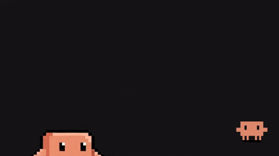

# Arcrawls: The Context-Aware Browser Pet

An open-source, interactive, context-aware browser mascot pet companion extension built using the [clawd-pet](https://github.com/abderrahimghazali/clawd-pet) SVG library. The pet crawls along the edges of your browser viewport, monitors your activity, and updates its expression in response to your browsing context and site errors!

*Mascot SVG assets are adapted from the open-source [clawd-pet](https://github.com/abderrahimghazali/clawd-pet) library by Abderrahim Ghazali, used under the MIT License.*

<p align="center">
   
</p>

<p align="center">
  <a href="https://www.producthunt.com/products/arcrawls-the-context-aware-browser-pet?embed=true&amp;utm_source=badge-featured&amp;utm_medium=badge&amp;utm_campaign=badge-arcrawls" target="_blank" rel="noopener noreferrer"></a>
</p>

<p align="center">
  <a href="https://chrome-stats.com/chrome/trending/trending-week" target="_blank">
    
  </a>
</p>

<p align="center">
  <a href="https://www.typescriptlang.org/"></a>
  <a href="#"></a>
  <a href="https://vitejs.dev/"></a>
  <a href="https://bun.sh/"></a>
  <a href="https://polyformproject.org/licenses/noncommercial/1.0.0"></a>
</p>

  ---

  ## Key Features

  * **Gravity-Driven Physics Engine**: Reliable floor/ceiling crawling with a built-in Gravity Engine, spring-physics, and intelligent edge-snapping (no more wall-sticking).
  * **Context-Aware Emotions**: Real-time expressions that react to typing speed, scroll depth, media playback, intent detection, and site errors.
  * **Lite Mode (Default)**: Efficient, rule-based behavior analysis using Regex and meta-tag analysis—zero downloads or API keys required.
  * **Brain Upgrade (Optional AI)**: Privacy-first, high-fidelity sentiment analysis using an on-device DistilBERT model. Features **Gemini Nano** integration to summarize full page DOM bodies natively, specifically targeting semantic `<main>` and `<article>` tags to prevent context-window overflow, complete with an 8-second safety timeout.
  * **Distraction-Free UI**: Schedule **Focus Blocks** to force Arcrawls into a quiet studying animation, or use **Ghost Mode** to automatically fade his opacity down to 30% whenever you are actively typing or scrolling.
  * **Performance Mode**: Halts cross-tab syncing and disables CSS aura shaders to save memory and CPU on low-end machines. Movement now utilizes a single GPU-composited `translate3d` update per frame to eliminate layout thrashing.
  * **Virtual Pet Progression**: Level up your pet through interactions, unlock costumes, and develop unique personality traits based on your browsing habits.
  * **Mascot Milestones**: Track significant growth markers, interaction records, and trait evolutions in a dedicated achievement dashboard.
  * **24-Hour AI Synapse**: Get daily generative reflections on your browsing habits synthesized by Gemini Nano (Brain Upgrade required).
  * **Comprehensive Dashboard**: Track 7-day interest analytics, manage work/sleep schedules, and customize domain-specific reactions.

  ### Install Size

  | Component | Size | When |
  |-----------|------|------|
  | **Chrome Web Store download** | **~6 MB** | Compressed install package |
  | **Installed on disk (Chrome details)** | **~22–25 MB** | Pet assets + bundled ONNX WASM |
  | Lite Mode core (assets + UI) | ~2 MB unpacked | Active by default (Regex rules) |
  | ONNX WASM runtime (bundled) | ~22 MB unpacked | Included; initialized when Brain Upgrade is on |
  | DistilBERT model weights | ~67 MB | Downloaded once from Hugging Face after you opt in |

  Lite Mode works immediately with no network downloads. The optional Brain Upgrade initializes the bundled WASM runtime and adds a one-time ~67 MB model fetch to your browser cache — your browsing text never leaves the device.

  ---

  ## Getting Started

  ### Prerequisites
  - [Node.js](https://nodejs.org/) (v18 or higher)
  - [Bun](https://bun.sh/) (recommended) or `npm`

  ### Installation & Build

  1. Navigate to the extension directory:
   ```bash
   cd context-aware-browser-pet
   ```
  2. Install the dev dependencies:
   ```bash
   bun install
   ```

  ### Available Scripts
  You can run the following scripts using Bun:

  - `bun run dev` - Starts Vite in watch mode for local development.
  - `bun run build` - Builds the extension for Chrome/Chromium to the `dist/` folder.
  - `bun run build:firefox` - Builds the extension for Firefox to the `dist-firefox/` folder.
  - `bun run test` - Runs the Vitest unit test suite.
  - `bun run test:e2e` - Runs Playwright end-to-end browser tests.
  - `bun run verify` - Runs TypeScript type-checking, unit tests, and E2E tests.
  - `bun run all` - Compiles the Chrome build, runs all verifications, and compiles the Firefox build.

  ### Loading the Extension in Chrome

  1. Open **Chrome** and navigate to `chrome://extensions`.
  2. Toggle on **Developer mode** in the top-right corner.
  3. Click the **Load unpacked** button in the top-left corner.
  4. Select the `dist/` directory located inside the `context-aware-pet` folder.
  5. Open any webpage (e.g. [github.com](https://github.com)) — your pet will slide onto the page! 🐾

  ### Loading the Extension in Firefox

  1. Build the Firefox bundle:
   ```bash
   bun run build:firefox
   ```
  2. Open **Firefox** and navigate to `about:debugging#/runtime/this-firefox`.
  3. Click **Load Temporary Add-on...**.
  4. Select `dist-firefox/manifest.json` inside the `context-aware-pet` folder.
  5. Open any normal HTTPS webpage (e.g. [github.com](https://github.com)) to verify that Arcrawls appears.

  Firefox currently runs Arcrawls in Lite Mode. The local Brain Upgrade and centralized offscreen audio paths depend on Chrome offscreen documents, which Firefox does not support yet.

  ---

  ## 🌍 Localization

Arcrawls ships with full interface and pet-speech localization in **10 languages**:

  | Code | Language | | Code | Language |
  |------|----------|-|------|----------|
  | `en` | English | | `ja` | 日本語 (Japanese) |
  | `es` | Español (Spanish) | | `zh_CN` | 中文（简体） (Simplified Chinese) |
  | `fr` | Français (French) | | `ko` | 한국어 (Korean) |
  | `de` | Deutsch (German) | | `hi` | हिन्दी (Hindi) |
  | `it` | Italiano (Italian) | | `pt_BR` | Português (Brasil) |

  **How it works**:
  - By default, Arcrawls follows your **browser's UI language** (`chrome.i18n`).
  - Open the **Sanctuary → Mascot & Style** page and use the **Interface Language** dropdown to force a specific language — the dashboard, popup, onboarding, the pet's speech bubbles, and AI reaction comments all switch instantly.
  - Each locale lives in `public/_locales/<code>/messages.json`. UI strings use named keys (e.g. `options_*`), while the pet's dialogue uses hash-derived keys (`speech_<fnv1a32>`), authored in English in code and extracted by `scripts/gen-speech-keys.mjs`.
  - To add a new language: create `public/_locales/<code>/messages.json` with the full key set (copy from `en` as a starting point), add it to `SUPPORTED_LOCALES` in `src/shared/locale.ts`, then run `node scripts/gen-speech-keys.mjs` and `node scripts/merge-speech.mjs <code>` to sync the `speech_*` keys.

  ---

  ## License & Noncommercial Usage

This project is open-source under the **[PolyForm Noncommercial License 1.0.0](LICENSE)**.

> ⚠️ **PolyForm Noncommercial License Notice:**  
> Free for personal use, hobby projects, educational institutions, public research, and noncommercial pursuits.  
> **Commercial distribution, resale, or monetization of this software or derivative works is strictly prohibited** without explicit written permission from the author (`fujidevv@duck.com`).

*Underlying mascot SVG assets are adapted from the open-source [clawd-pet](https://github.com/abderrahimghazali/clawd-pet) library and used under the MIT License.*

---

## Privacy & Security

Arcrawls is engineered to be **100% on-device** with **zero server uploads** and zero telemetry. Read our full [Privacy Policy](PRIVACY.md) for a detailed breakdown of host permissions, local ONNX/Gemini model downloads, private-page exclusions, and user data controls.

  ---

  ## Star History

  <a href="https://www.star-history.com/?repos=fujiDevv%2Fcontext-aware-browser-pet&type=date&legend=top-left">
   <picture>
     <source media="(prefers-color-scheme: dark)" srcset="https://api.star-history.com/chart?repos=fujiDevv/context-aware-browser-pet&type=date&theme=dark&legend=top-left" />
     <source media="(prefers-color-scheme: light)" srcset="https://api.star-history.com/chart?repos=fujiDevv/context-aware-browser-pet&type=date&legend=top-left" />
     
   </picture>
  </a>
